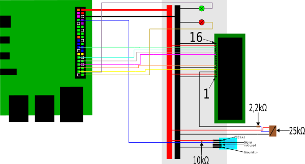

# DHT11 Sensor mit LCD,Dioden und Thingspeak

## Darstellung
### Aufbau


## Code

### Sensordaten

```python
	sensor = Adafruit_DHT.DHT11
	pin = 4

...

	def getSensorData():
	    humidity, temperature = Adafruit_DHT.read_retry(sensor, pin)
	    return (str(humidity), str(temperature))
```
Benötigt zum Erfassen der Messwerte des DHT11-Sensors.
Bestimmung des Sensors und des Messkanals, anschließende Bestimmung der ausgegebenen Werte.

### Diagramm

```python
	def update_plot():
	    axs[0].clear()
	    axs[1].clear()
	    
	    axs[0].set_title('Luftfeuchtigkeit')
	    axs[0].set_xlabel('Zeit (h, min, sec)')
	    axs[0].set_ylabel('Luftfeuchtigkeit (%)')

	    axs[1].set_xlabel('Zeit (h, min, sec)')
	    axs[1].set_title('Temperatur')
	    axs[1].set_ylabel('Temperatur (°C)')
	    
	    axs[0].plot(xshum[-5:], yshum[-5:], color='b', label = "Luftfeuchtigkeit")
	    axs[0].axhline(y = np.average(yshum, axis = None), color = 'g', ls = '-', label = "\u00D8 Luftfeuchtigkeit")
	    
	    axs[1].plot(xstem[-5:], ystem[-5:], color='r', label = "Temperatur")
	    axs[1].axhline(y = np.average(ystem, axis = None), color = 'm', ls = '-', label = "\u00D8 Temperatur")

	    axs[0].legend(bbox_to_anchor = (1.0, 1), loc = 'upper center')
	    axs[1].legend(bbox_to_anchor = (1.0, 1), loc = 'upper center')

...
	
	#Beschriftung der x-Achsen
	def xaxisRealtime():
	    xshum.append(dt.datetime.now().strftime('%H:%M:%S'))
	    xstem.append(dt.datetime.now().strftime('%H:%M:%S'))
	
	#Beschriftung der y-Achsen    
	def yaxisMeasure():
	    yshum.append(humidity)
	    ystem.append(temperature)

...

	xshum = []
	xstem = []
	yshum = []
	ystem = []
	
...	

	plt.ion()
        fig, axs = plt.subplots(2, 1, constrained_layout=True)
        fig.canvas.set_window_title('Live Chart')    

```
Darstellung des Computer erstellten Live-Plots

### LCD

```python
	#Verkabelung
	# The wiring for the LCD is as follows:
	# 1 : GND
	# 2 : 5V
	# 3 : Contrast (0-5V)*
	# 4 : RS (Register Select)
	# 5 : R/W (Read Write)       - GROUND THIS PIN
	# 6 : Enable or Strobe
	# 7 : Data Bit 0             - NOT USED
	# 8 : Data Bit 1             - NOT USED
	# 9 : Data Bit 2             - NOT USED
	# 10: Data Bit 3             - NOT USED
	# 11: Data Bit 4
	# 12: Data Bit 5
	# 13: Data Bit 6
	# 14: Data Bit 7
	# 15: LCD Backlight +5V**
	# 16: LCD Backlight GND
	
	#Pindefinierung
	LCD_RS = 26
	LCD_E  = 19
	LCD_D4 = 13 
	LCD_D5 = 6
	LCD_D6 = 5
	LCD_D7 = 11
	LED_ON = 15

	LCD_WIDTH = 16
	LCD_CHR = True
	LCD_CMD = False
	LCD_LINE_1 = 0x80 
	LCD_LINE_2 = 0xC0 
	E_PULSE = 0.00005
	E_DELAY = 0.00005

	def lcd_init():
	  GPIO.setmode(GPIO.BCM)       
	  GPIO.setup(LCD_E, GPIO.OUT) 
	  GPIO.setup(LCD_RS, GPIO.OUT)
	  GPIO.setup(LCD_D4, GPIO.OUT) 
	  GPIO.setup(LCD_D5, GPIO.OUT) 
	  GPIO.setup(LCD_D6, GPIO.OUT) 
	  GPIO.setup(LCD_D7, GPIO.OUT) 
	  GPIO.setup(LED_ON, GPIO.OUT)  

	  lcd_byte(0x33,LCD_CMD)
	  lcd_byte(0x32,LCD_CMD)
	  lcd_byte(0x28,LCD_CMD)
	  lcd_byte(0x0C,LCD_CMD)  
	  lcd_byte(0x06,LCD_CMD)
	  lcd_byte(0x01,LCD_CMD)  
	
	#Möglichkeiten der Darstellung
	def lcd_string(message,style):
	  if style==1:
	    message = message.ljust(LCD_WIDTH," ")  # style=1 Left justified  
	  elif style==2:
	    message = message.center(LCD_WIDTH," ") # style=2 Centred
	  elif style==3:
	    message = message.rjust(LCD_WIDTH," ")  # style=3 Right justified

	  for i in range(LCD_WIDTH):
	    lcd_byte(ord(message[i]),LCD_CHR)

	def lcd_byte(bits, mode):
	  GPIO.output(LCD_RS, mode) 

	  GPIO.output(LCD_D4, False)
	  GPIO.output(LCD_D5, False)
	  GPIO.output(LCD_D6, False)
	  GPIO.output(LCD_D7, False)
	  if bits&0x10==0x10:
	    GPIO.output(LCD_D4, True)
	  if bits&0x20==0x20:
	    GPIO.output(LCD_D5, True)
	  if bits&0x40==0x40:
	    GPIO.output(LCD_D6, True)
	  if bits&0x80==0x80:
	    GPIO.output(LCD_D7, True)

	  time.sleep(E_DELAY)    
	  GPIO.output(LCD_E, True)  
	  time.sleep(E_PULSE)
	  GPIO.output(LCD_E, False)  
	  time.sleep(E_DELAY)      

	  GPIO.output(LCD_D4, False)
	  GPIO.output(LCD_D5, False)
	  GPIO.output(LCD_D6, False)
	  GPIO.output(LCD_D7, False)
	  if bits&0x01==0x01:
	    GPIO.output(LCD_D4, True)
	  if bits&0x02==0x02:
	    GPIO.output(LCD_D5, True)
	  if bits&0x04==0x04:
	    GPIO.output(LCD_D6, True)
	  if bits&0x08==0x08:
	    GPIO.output(LCD_D7, True)

	  time.sleep(E_DELAY)    
	  GPIO.output(LCD_E, True)  
	  time.sleep(E_PULSE)
	  GPIO.output(LCD_E, False)  
	  time.sleep(E_DELAY)   

	#gemessenen Werte
	def LCD1():
	    lcd_byte(LCD_LINE_1, LCD_CMD)
	    lcd_string("Luft: %d %%" % humidity, 1)
	    lcd_byte(LCD_LINE_2, LCD_CMD)
	    lcd_string("Temp: %d \u0027C" % temperature, 1)
	    
	    sleep(2.5)
	    
	#aktuelle Zeit    
	def LCD2():
	    lcd_byte(LCD_LINE_1, LCD_CMD)
	    lcd_string("Datum:%s" %time.strftime("%m.%d.%Y"), 1)
	    lcd_byte(LCD_LINE_2, LCD_CMD)
	    lcd_string("Zeit: %s" %time.strftime("%H:%M:%S"), 1)
	    
	    sleep(0.5)
...	    
	    lcd_byte(LCD_LINE_1, LCD_CMD)
            lcd_string("Sending Data",2)
            sleep(1.5)
...
            lcd_byte(LCD_LINE_2, LCD_CMD)
            lcd_string("Data sent",2)
            
            sleep(1.5)
...            
            lcd_byte(LCD_LINE_2, LCD_CMD)
            lcd_string("No connection!",2)
            sleep(1.5)
```
Richtige Verkabelung des LCD. Anschließend Definierung des Displays, Möglichkeiten der Darstellung.
Anzeige der aktuellen Zeit und der gemessenen Werte.

### Dioden

```python
	humx = 80
	temx = 20
	
...	
	
	#Einstellen der Ein/Ausgänge
	GPIO.setmode(GPIO.BCM)           
	GPIO.setup(21, GPIO.OUT)

	GPIO.setmode(GPIO.BCM)           
	GPIO.setup(20, GPIO.OUT)

...
	#Definierung der Funktionsweise der Dioden
	def lightsignals():  
	    if humidity >= humx:
		GPIO.output(21, 1)
		time.sleep(1)                 
	     
	    else:
		GPIO.output(21, 0)
		                              
	    if temperature <= temx:
		GPIO.output(20, 1)
		time.sleep(1)                 
	     
	    else:
		GPIO.output(20, 0) 
```
Die Dioden gehen bei einem bestimmten Messwert an.

### Thingspeak

```python
	#Write-Key des Projekts
	write_api = '82E9BOZQJOWXKO4W'
...
	baseURL = 'https://api.thingspeak.com/update?api_key=%s' % write_api
...
	#Verzögerung
	send_counter = 0
...
	send_counter += 1
...		
		if send_counter == 3:
...		    
		    try:
		    #Ort an dem geschrieben werden soll
		        f = urlopen(baseURL + "&field1=%s&field2=%s" % (humidity, temperature))
		        
		        #print (f.read())
		        f.close()
		        sleep(1.5)                
...		    
		    #Zurücksetzten des Zählers  
		    send_counter = 0
```
Da nur alle 15sec bei einem kostenlosen Account etwas geschrieben werden kann, ersetzt die der Counter die überflüßigen Sekunden, wodurch das Programm weiterhin durchlaufen kann ohne jedes mal warten zu müssen.

### Main_Code

```python
if __name__ == '__main__':
    
    lcd_init()
  
    GPIO.output(LED_ON, False)

    xshum = []
    xstem = []
    yshum = []
    ystem = []
    
    send_counter = 0

    lcd_byte(LCD_LINE_1, LCD_CMD)
    lcd_string("Booting...",2)
    time.sleep(30)
    
    #plt.ion()
    #fig, axs = plt.subplots(2, 1, constrained_layout=True)
    #fig.canvas.set_window_title('Live Chart')

    
    while True:
        
        update_plot()
        
        humidity_ts, temperature_ts = getSensorData()
        humidity = float(humidity_ts)
        temperature = float(temperature_ts)
            
        humidity_ts, temperature_ts = getSensorData()       
               
        LCD1()    

        LCD2()  

#        xaxisRealtime()

#        yaxisMeasure()
        
        #plt.show()
        #plt.pause(0.0001)

#        lightsignals()

        send_counter += 1
        
        if send_counter == 3:
            lcd_byte(LCD_LINE_1, LCD_CMD)
            lcd_string("Sending Data",2)
            sleep(1.5)
            try:
                f = urlopen(baseURL + "&field1=%s&field2=%s" % (humidity, temperature))
                lcd_byte(LCD_LINE_2, LCD_CMD)
                lcd_string("Data sent",2)
                #print (f.read())
                f.close()
                sleep(1.5)
            except:
                lcd_byte(LCD_LINE_2, LCD_CMD)
                lcd_string("No connection!",2)
                sleep(1.5)
                
            send_counter = 0
```
Der Teil des Code's der auf die Definierungen zugreift und das Programm ausführt